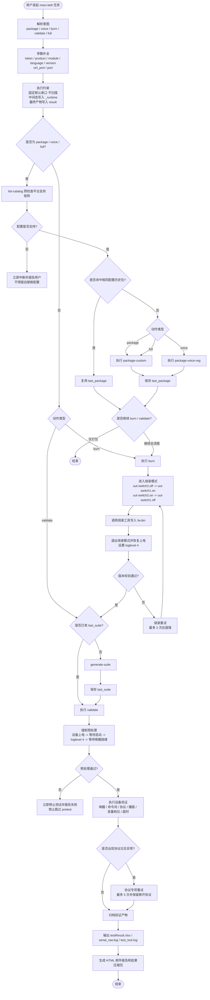

# mars-belt 工作流程图

以下流程图描述的是 `mars-belt` 的真实业务工作流程，基于 `SKILL.md` 与 `scripts/mars_belt.py` 梳理。

## 关键规则

- `package`、`voice`、`full` 在执行前必须先做平台支持预检查。
- `burn` 只能使用既定的 `switch` 控制链路，不允许替换控制方式。
- `validate` 的预处理是强制步骤，失败后必须终止，不能使用跳过参数绕过。
- `last_package`、`last_suite` 会被复用，用于减少重复打包和重复生成测试集。
- `scripts/_runtime/` 保存中间态，`scripts/result/` 保存最终交付物。
